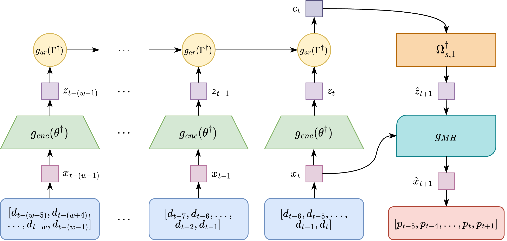

<p align="center">
    
    <h1 align="center">
        Spatial Probabilistic Contrastive Predictive Coding
    </h1>
</p>


This repository contains the code to reproduce the results of our paper _[Spatiotemporal Disease Case Prediction Using Contrastive
Predictive Coding]()_, submitted to the 2022 Spatial'Epi workshop at ACM SIGSPATIAL.

<!-- TABLE OF CONTENTS -->

## Table of Contents

- [Citation](#citation)
- [About the Project](#about-the-project)
- [Datasets](#datasets)
- [Getting Started](#getting-started)
- [Repository Structure](#repository-structure)
- [Contact](#contact)
- [Acknowledgements](#acknowledgements)
- [References](#references)

<!-- Citation -->

## Citation

If you found our paper or code useful, please cite:
<TODO: Add BibTex Citation>

<!-- ABOUT THE PROJECT -->

## About The Project

Time series prediction models have played a vital role in guiding effective policymaking and response during the COVID-19 pandemic by predicting future cases and deaths at the country, state, and county levels. However, for emerging diseases, there is not sufficient historic data to fit traditional supervised prediction models. In addition, such models do not consider human mobility between regions. To mitigate the need for supervised models and to include human mobility data in the prediction, we propose Spatial Probabilistic Contrastive Predictive Coding (SP-CPC) which leverages Contrastive Predictive Coding (CPC), an unsupervised time-series representation learning approach. We augment CPC to incorporate a covariate mobility matrix into the loss function, representing the relative number of individuals traveling between each county on a given day. The proposal distribution learned by the algorithm is then sampled by the Metropolis-Hastings algorithm to give a final prediction of the number of COVID-19 cases. We find that the model applied to COVID-19 data is able to make accurate short-term predictions, more accurate than ARIMA and simple time-series extrapolation methods, one day into the future. However, for longer-term predictions windows of seven or more days into the future, we find that our predictions are not as competitive and require future research.

<!-- Datasets -->

## Datasets

Old versions of the datasets used for training the model in the paper can be found in the `data/` directory. Newer versions of the datasets can be found at the links below.

`us-counties-2020.csv`, `us-counties-2021.csv`, and `us-counties-2022.csv` can all be downloaded at [nytimes/covid-19-data](https://github.com/nytimes/covid-19-data). `daily_county2county_2021_04_15_int.csv` can be downloaded at [GeoDS/COVID19USFlows](https://github.com/GeoDS/COVID19USFlows-DailyFlows/tree/master/daily_flows/county2county), but this is the newest file available. `mainland_fips_master.csv` can be downloaded at [kjhealy/fips-codes](https://github.com/kjhealy/fips-codes)

<!-- Getting Started -->

## Getting Started

First, download the required dependencies for the project. A minimum of Python 3.7 is required to run this project (due to ordered dictionaries).

First, install the requirements for this project. If you are using your base environment, use `pip install -r requirements.txt` or if you are using a Conda environment, use `conda install --file requirements.txt`. Not all requirements may be on the list, however, so follow the appropriate prompts from your terminal.

To obtain the mobility dictionary for any number of counties, first, run `gen_all_mobility_mat.py`. Then, to obtain a smaller, renormalized sample of the mobility dictionary, update the fips_codes list to include the FIPS codes for what you want to run your code on, and then run `renormalize_mob_custom.py`. Make sure the list of counties you pass into this custom list is the same as in dataset.counties in `config.yaml`.

If you are choosing to use comet, make sure to replace the API key in `config.yaml` and the project_name in `main_multicounty.py`. **Using comet is not necessary, and can be disabled by setting `has_comet` to `false` in main_multicounty.py and relevant files.** Then, run the command below to begin the training.

```
python3 main_multicounty.py
```

Then, run the appropriate file according to the [repository structure](#repository-structure).

<!-- Repository Structure -->

## Repository Structure

The log files contain the model structures and hyperparameters used for training in that experiment. The final_models folder contains the final trained models.

| Path                                               | Description                                                                                                                                                                                          |
| -------------------------------------------------- | ---------------------------------------------------------------------------------------------------------------------------------------------------------------------------------------------------- |
| `arima_7day.py`                                    | Trains and tests a baseline ARIMA model predicting the next 7 days of new case data using 21 days of past data.                                                                                      |
| `arima_1day.py`                                    | Trains and tests a baseline ARIMA model predicting the next 1 day of new case data using 13 days of past data.                                                                                       |
| `constant_interpolation_7day.py `                  | Calculates the mean average percentage error between the case value for the next seven days based on the case values seven days prior.                                                               |
| `constant_interpolation_1day.py`                   | Calculates the mean average percentage error between the case value for the next day based on the case values seven days prior.                                                                      |
| `logs/nospatial-30counties-dim120.log`             | Log file for training a CPC model with no spatial data on 30 counties with an encoder/autoregressive dimension of 120.                                                                               |
| `logs/spatial-30counties-dim120.log`               | Log file for training the Spatial CPC model with spatial data on 30 counties with an encoder/autoregressive dimension of 120.                                                                        |
| `logs/spatial-30counties-dim120-leakyrelu.log`     | Log file for training the Spatial CPC model with spatial data on 30 counties with an encoder/autoregressive dimension of 120 and a LeakyReLU in place of a ReLU in the previous two experiments.     |
| `logs/spatial-30counties-dim60.log`                | Log file for training the Spatial CPC model with spatial data on 30 counties with an encoder/autoregressive dimension of 60.                                                                         |
| `logs/spatial-30counties-dim60-rnn.log`            | Log file for training the Spatial CPC model with spatial data on 30 counties with an encoder/autoregressive dimension of 60 and an RNN in place of a GRU.                                            |
| `logs/spatial-30counties-dim60-linear.log`         | Log file for training the Spatial CPC model with spatial data on 30 counties with an encoder/autoregressive dimension of 60 and a single `Linear` layer in place of a `Conv1D` layer in the encoder. |
| `logs/spatial-30counties-dim60-nonoverlapping.log` | Log file for training the Spatial CPC model with spatial data on 30 counties with an encoder/autoregressive dimension of 60 and nonoverlapping data.                                                 |
| `final_models/...`                                 | Final trained models produced by the experiments with the corresponding log name.                                                                                                                    |
| `config.yaml`                                      | Config file for adjusting hyperparameters.                                                                                                                                                           |
| `main_multicounty.py`                              | Python script to train Spatial CPC. Change the imported dataset at the top of the file to change which dataset the model uses.                                                                       |
| `README.md`                                        | README file.                                                                                                                                                                                         |
| `requirements.txt`                                 | Requirements for running this repository.                                                                                                                                                            |
| `test_predict.py`                                  | Python script to generate predictions using Metropolis-Hastings.                                                                                                                                     |
| `utils/dataset_nonoverlap.py`                      | Contains dataset classes for the nonoverlapping (Experiment 2) dataset in training Spatial CPC.                                                                                                      |
| `utils/dataset_overlap_cpc.py`                     | Contains dataset classes for the overlapping (Experiment 1) dataset and mobility data in training Spatial CPC.                                                                                       |
| `utils/dataset_overlap_mh.py`                      | Contains dataset classes for the overlapping dataset and mobility data required for evaluating Metropolis-Hastings.                                                                                  |
| `utils/logger.py`                                  | Contains helper functions for logging during training and validation.                                                                                                                                |
| `utils/seed.py`                                    | Contains helper functions for setting the random seeds for all libraries.                                                                                                                            |
| `utils/train.py`                                   | Contains helper functions for training the model.                                                                                                                                                    |
| `utils/validation.py`                              | Contains helper functions for validating the model during training.                                                                                                                                  |
| `model/models.py`                                  | Contains classes for the PyTorch models described in the paper and the code for Metropolis-Hastings.                                                                                                 |
| `mobility/gen_all_mobility_mat.py`                 | Python script to obtain the mobility dictionary for all 3145 US FIPS codes.                                                                                                                          |
| `mobility/renormalize_mob_custom.py`               | Python script to obtain a renormalized mobility dictionary for any set of US FIPS codes.                                                                                                             |
| `figs/...`                                         | Contains figures required for this README.                                                                                                                                                           |
| `data/...`                                         | Contains datasets described in the [Datasets](#datasets) section.                                                                                                                                    |

<!-- Contact -->

## Issues/Contact

If you find any issues with this repository, please use the Issues tab or contact us using the emails provided in the paper.

<!-- Acknowledgements -->

## Acknowledgements

We would like to express our deepest gratitude to our research advisors Professor Andreas Züfle at Emory University and Dr. Hoang Duy Thai at George Mason University for their constant support, ideas, and feedback. Many thanks also to the [Aspiring Scientists Summer Internship Program](https://science.gmu.edu/assip) at George Mason University which provided us with the opportunity to conduct this research project this summer.

<!-- Funding -->

## Funding

This material is based upon work supported by the National Science Foundation under Grant No. DEB-2109647 for "Data-Driven Modeling to Improve Understanding of Human Behavior, Mobility, and
Disease Spread." Any opinions, findings, conclusions, or recommendations expressed in this material are those of the author(s) and do not necessarily reflect the views of the National Science Foundation. This research was additionally supported by the Aspiring Scientists Summer Internship Program (ASSIP) at George Mason University.

<!-- References -->

## References

Parts of this repository are based on [vgaraujov/CPC-NLP-PyTorch](https://github.com/vgaraujov/CPC-NLP-PyTorch).
